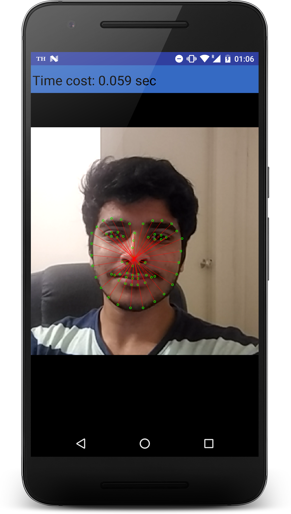

# Real Time Affective State Estimation for RoboTutor

### APK
Download the .apk file from here - https://drive.google.com/drive/folders/1KkIkbG-cJRViVk6QwcXzRamhvhZE4RDi?usp=sharing

### Log Files
* Stored in the system storage under : `RoboFeel/RoboFeelLogs_<Day> <Month> <Date> <hh:mm:ss> <Timezone> <year>.json` .   Images are stored in `RoboFeel/Images`
* Log format : Logs are for each image file which contains the time stamps at start of the log
* Logs contain :   1. Number of Faces detected   2. Top left and bottom right corners of Bounding Boxes of faces (list of strings)   3. Landmarks of Faces (list of list of Points)   4. Histogram of Oriented Gradients (list of list of floats)
* Sample :` {"ImageFilename":"\/storage\/emulated\/0\/RoboFeel\/Images\/Images_Mon May 24 11:03:42 GMT+05:30 2021\/images_Mon May 24 11:03:46 GMT+05:30 2021_0.0.jpg","Number of Faces":1,"Bounding boxes":"[Left:36, Top:36, Right:161, Bottom:161, Label:face]","Landmarks":"[[Point(34, 82), Point(33, 96), Point(31, 110), Point(32, 125), Point(35, 138), Point(42, 150), Point(52, 160), Point(65, 166), Point(80, 170), Point(96, 171), Point(111, 169), Point(124, 162), Point(133, 152), Point(140, 142), Point(145, 129), Point(149, 117), Point(152, 105), Point(51, 55), Point(59, 48), Point(70, 44), Point(82, 46), Point(93, 52), Point(108, 55), Point(119, 54), Point(131, 57), Point(140, 64), Point(144, 75), Point(99, 67), Point(97, 72), Point(96, 77), Point(94, 82), Point(78, 96), Point(84, 98), Point(91, 100), Point(98, 101), Point(104, 101), Point(60, 69), Point(67, 66), Point(75, 67), Point(81, 72), Point(74, 72), Point(66, 71), Point(111, 79), Point(119, 76), Point(126, 78), Point(132, 84), Point(125, 83), Point(117, 81), Point(57, 120), Point(69, 112), Point(81, 109), Point(88, 112), Point(96, 112), Point(106, 119), Point(116, 131), Point(104, 136), Point(92, 136), Point(85, 134), Point(77, 132), Point(66, 128), Point(61, 120), Point(80, 114), Point(88, 116), Point(95, 117), Point(111, 129), Point(94, 130), Point(87, 128), Point(79, 127)]]","HOGS":"[0.45247918, 0.15180938, 0.107360065, 0.18216279, 0.45247918, 0.0, 0.0, 0.010599345, 0.029618869, 0.06980042 ...]"}`

### Environments
* Device : Google Pixel
* API    : 25 (Nougat)
* Time   : 50ms ~ 70ms

### Demo

